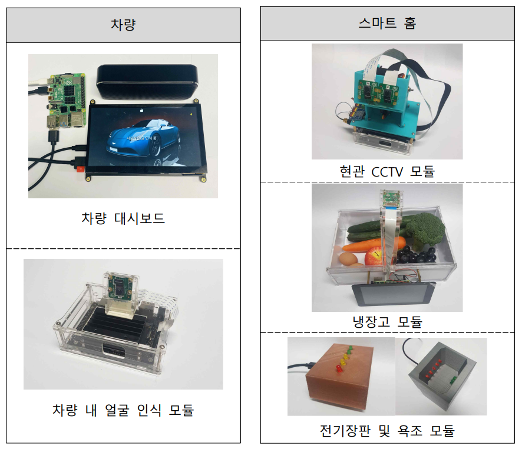
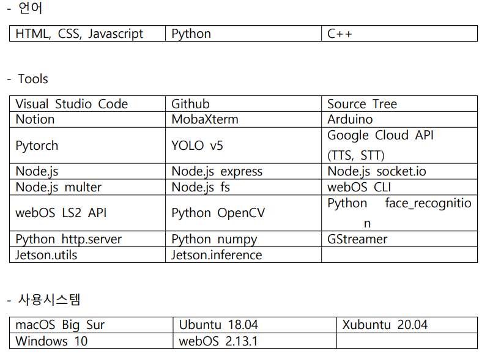

# 2021ESWContest_webOS_3004
### 팀명
THINCAR
### 작품명   
THINCAR의 움직이는 Smart Home  
### 제품 시연 동영상
Link : [YOUTUBE](https://www.youtube.com/watch?v=FfYQBBg1iSo)
### 작품설명   
1. 1인 가구의 불편함을 개선할 수 있는 운전자 편의기능 제공
2. 대시보드에서 스마트 홈 IoT 기기를 제어할 수 있는 다양한 환경 제공
3. Drowsiness detection을 이용한 주행 집중도와 졸음 운전지수 제공
### 시제품
</img>
### 전체 구상도
</img>
### 차량용 대시보드 화면
</img>   
FaceID를 통해서 사용자 인증 후 볼 수 있는 메인화면   
</img>   
차량용 대시보드를 통해서 스마트 홈의 냉장고 내부를 확인   
</img>   
차량용 대시보드를 통해서 스마트 홈의 현관 기록을 확인   
</img>   
현재 운전자의 상태를 감지하여 졸음 운전 지수,주행 집중도 모니터링 및 상태기반 IoT기능 추천   
### 스마트 홈 (냉장고 및 현관) 모듈
</img>   
스마트 홈의 냉장고 모듈의 화면   
</img>   
스마트 홈의 현관 모듈의 화면   
### 파일 구성   
</img>   
### 개발 정보   
</img>   
